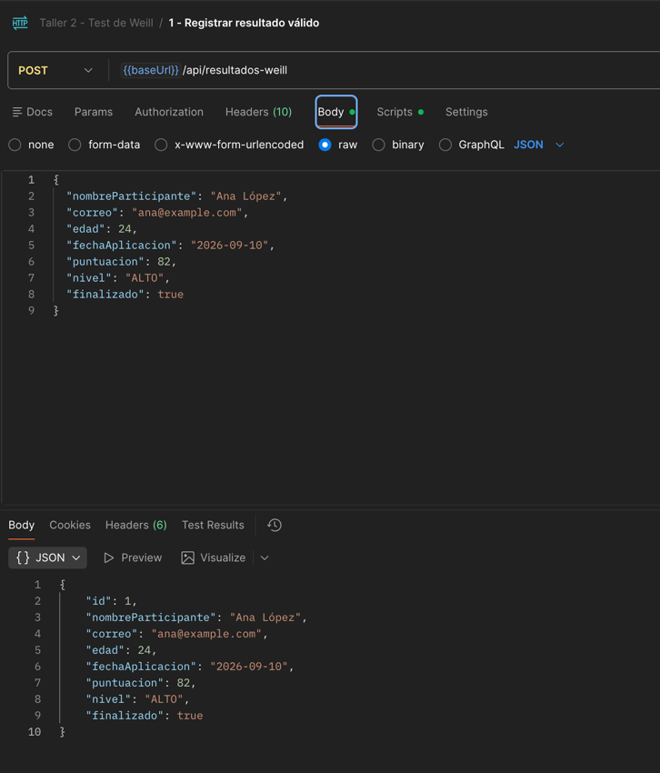
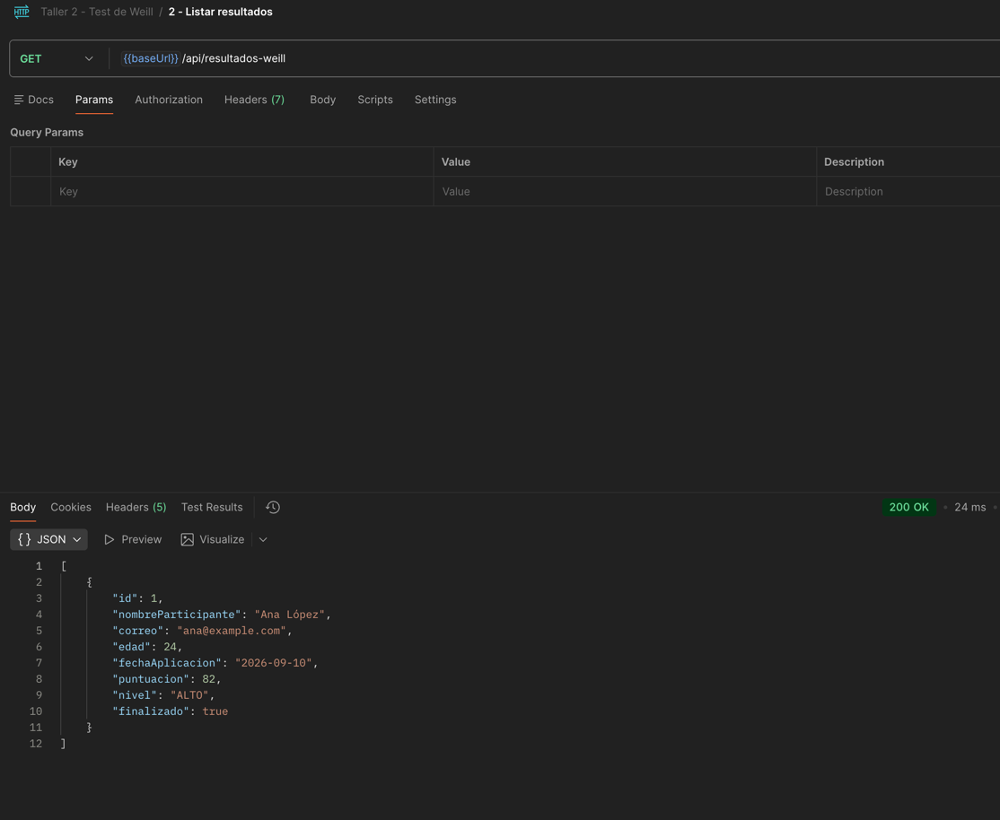
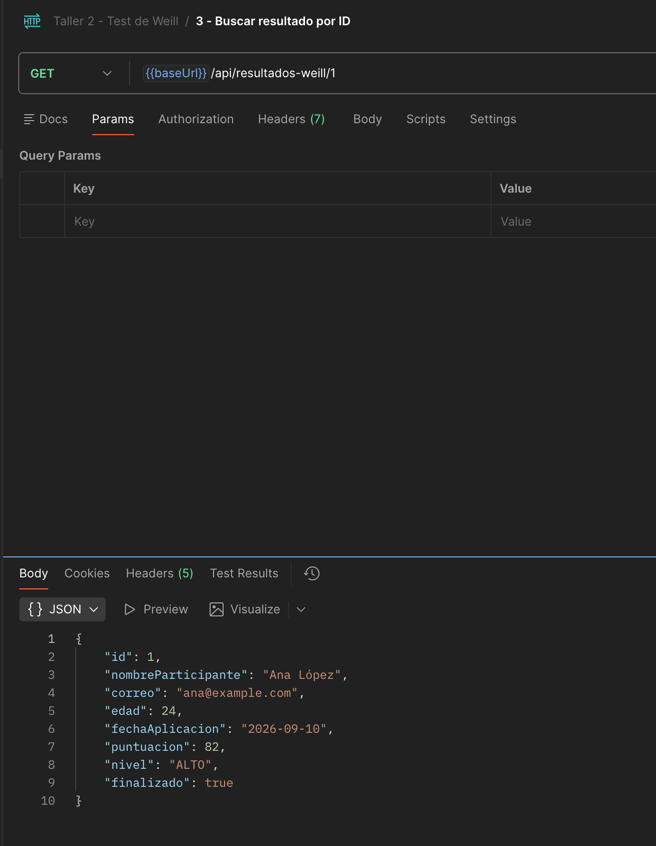
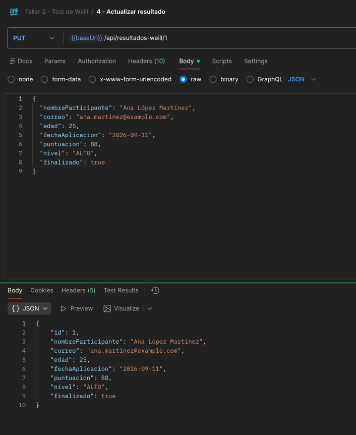
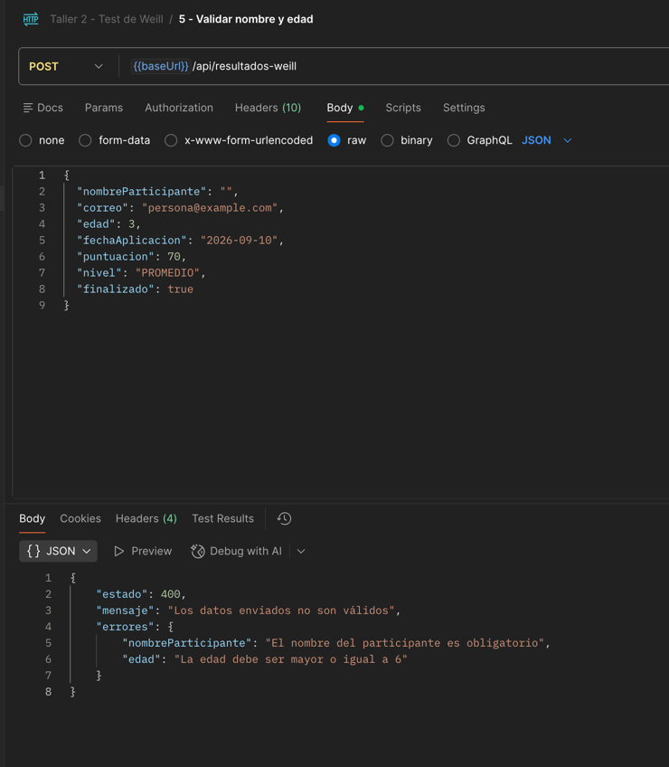
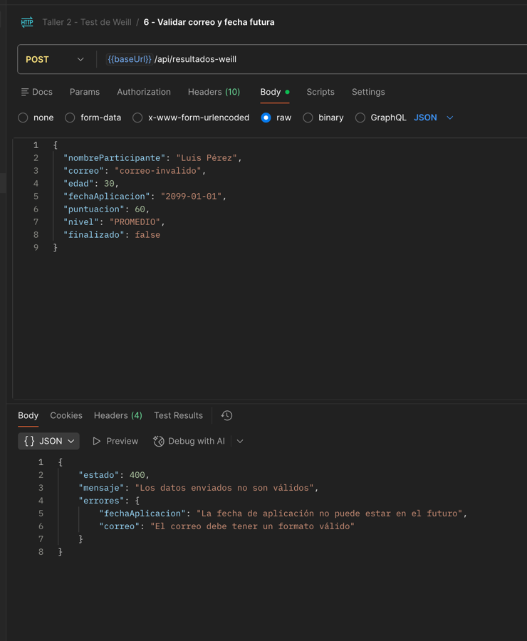
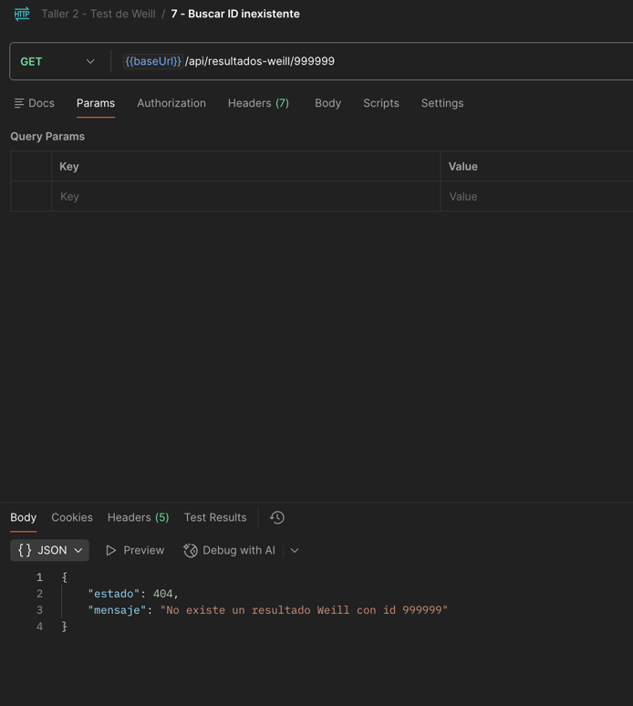
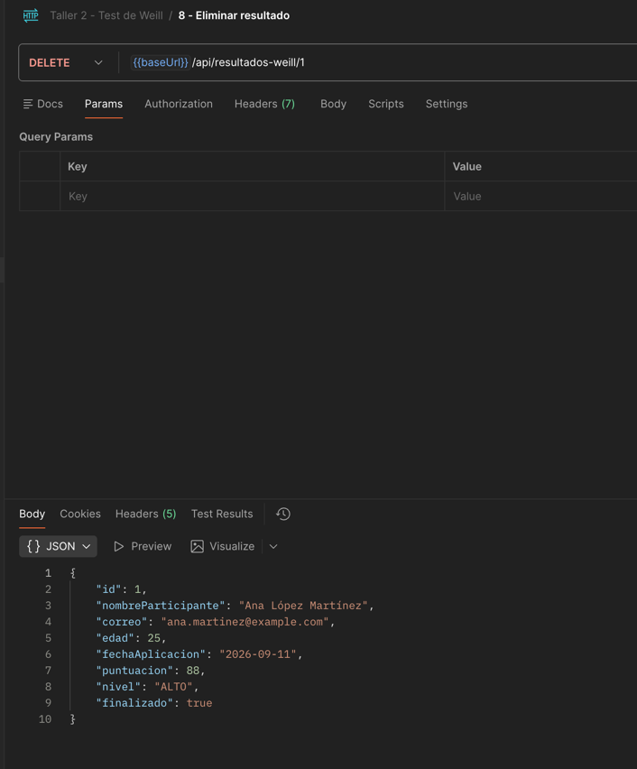

# Evidencias de ejecución — Test de Weill

Capturas obtenidas al ejecutar en Postman las ocho solicitudes de la colección
`Taller2-Weill.postman_collection.json`.

## 1. Registrar un resultado válido — POST

## 2. Listar todos los resultados — GET

## 3. Buscar un resultado por ID — GET

## 4. Actualizar un resultado — PUT

## 5. Validar nombre y edad — POST

## 6. Validar correo y fecha — POST

## 7. Buscar un ID inexistente — GET

## 8. Eliminar un resultado — DELETE

